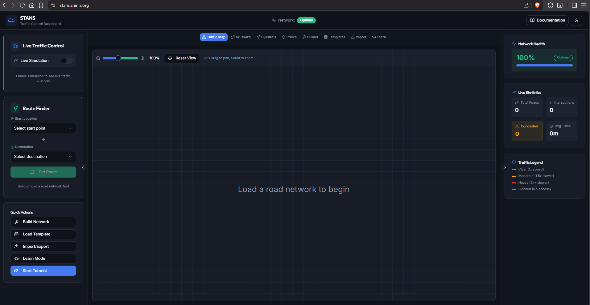
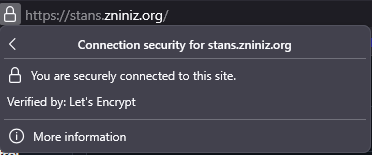
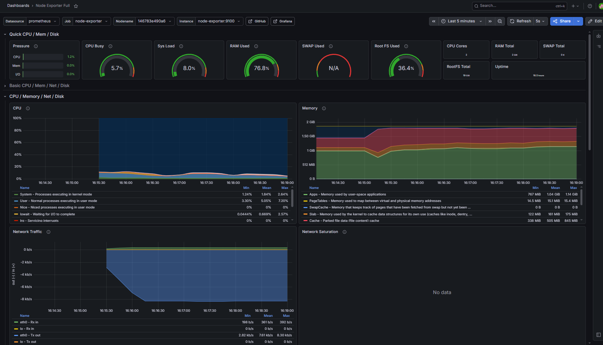
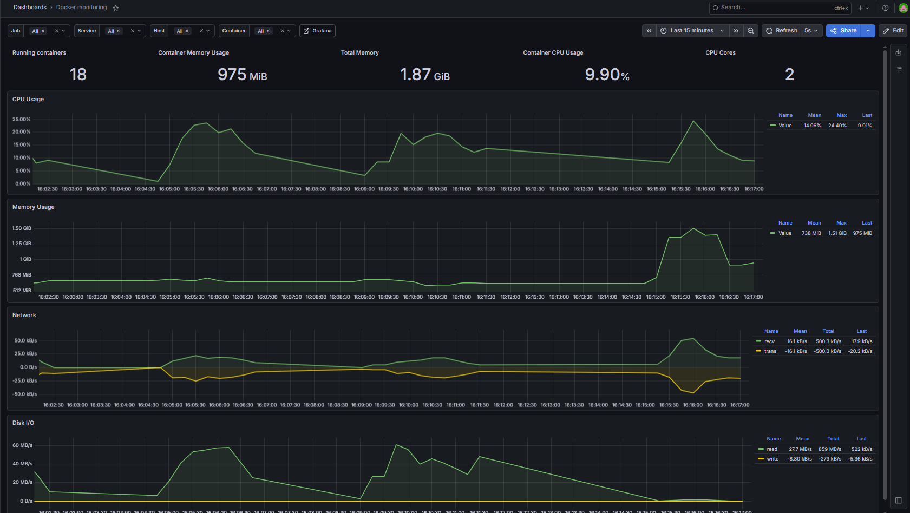
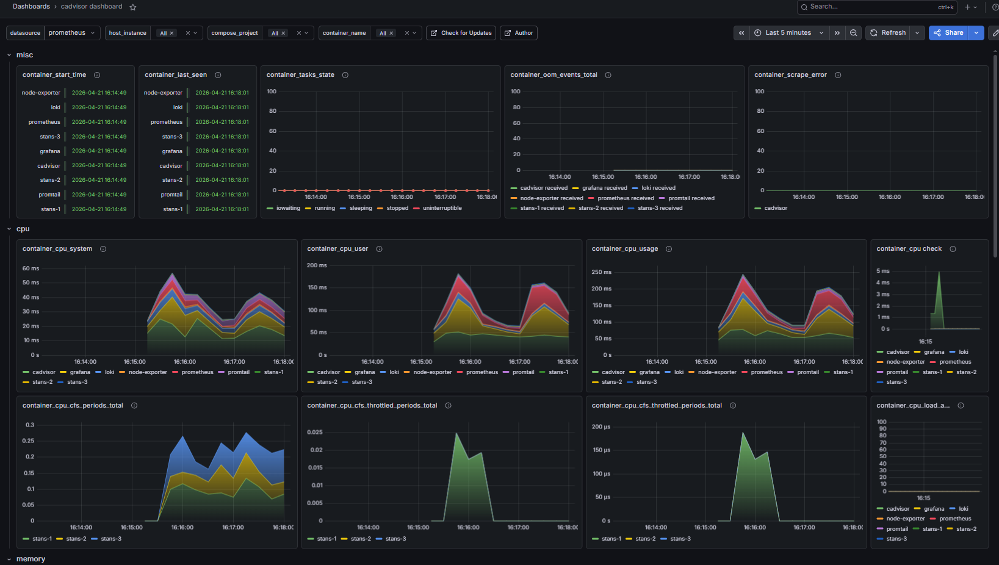
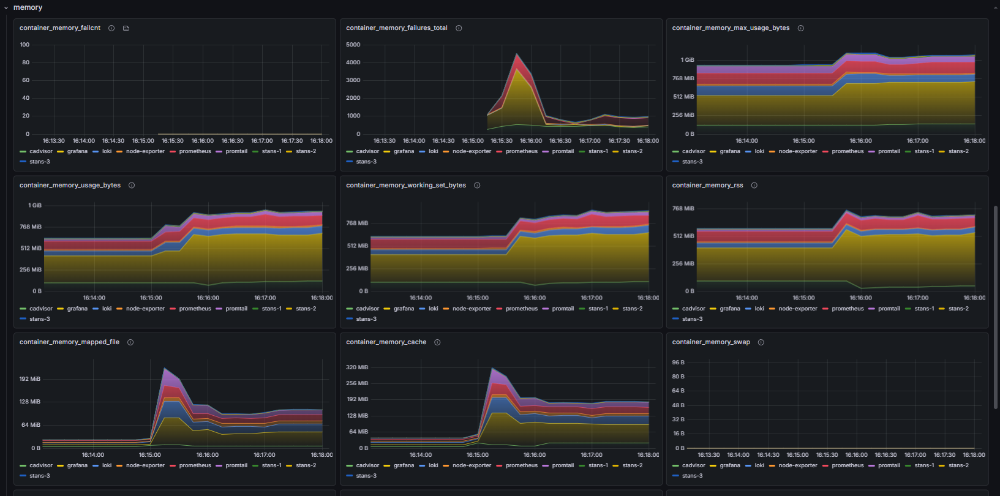
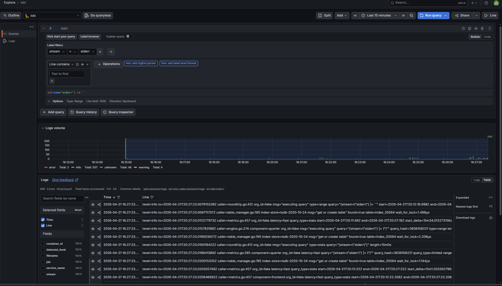

# STANS — Smart Traffic-Aware Navigation System
---
## View full [DOCUMENTATION](docs/assets.md)
---
### DevOps Deployment Guide

A full DevOps pipeline for a React/TypeScript application — containerized with Docker, automated with GitHub Actions CI/CD, and deployed to AWS EC2 with SSL.




---

## What Was Built

| Layer | Technology |
|---|---|
| Application | React + TypeScript (Vite) |
| Containerization | Docker multi-stage build |
| Web server (container) | nginx:alpine |
| CI/CD | GitHub Actions |
| Container registry | Docker Hub |
| Cloud provider | AWS EC2 (Ubuntu 22.04) |
| Reverse proxy + SSL | nginx + Let's Encrypt (Certbot) |
| DNS | Cloudflare |

---

## Architecture

```
git push origin main
        │
        ▼  GitHub Actions (~3 min)
        ├── Job 1: lint-and-tests  →  npm ci + npm run build
        ├── Job 2: docker          →  build image + push to Docker Hub
        └── Job 3: deploy          →  SSH into EC2 + docker pull + restart

Internet (HTTPS :443)
        │
        ▼
Host nginx on EC2  (SSL termination via Let's Encrypt)
        │
        ▼  HTTP to localhost:8080
Docker container  (<DOCKER_USERNAME>/stans-app:latest)
        │
        ▼
nginx:alpine serving /dist (compiled React app)
```

---

## Part 1 — Fork and Setup

### Prerequisites
- Node.js 18 or 20 (`node -v` to check)
- Git

### Steps

```bash
# 1. Fork the repository on GitHub, then clone your fork
git clone https://github.com/YOUR_USERNAME/stans.git
cd stans

# 2. Install dependencies and run locally
npm install
npm run dev
# App runs at http://localhost:5173

# 3. Verify the production build works before touching Docker
npm run build
ls dist/
# Should show index.html and assets/
```

> If you get peer dependency errors: `npm install --legacy-peer-deps`

---

## Part 2 — Containerization

### Files to create at the repo root

**`Dockerfile`**
```dockerfile
# Stage 1: Build
FROM node:20-alpine AS builder
WORKDIR /app
COPY package.json package-lock.json ./
RUN npm ci
COPY . .
RUN npm run build

# Stage 2: Serve
FROM nginx:stable-alpine AS runner
RUN rm /etc/nginx/conf.d/default.conf
COPY nginx.conf /etc/nginx/conf.d/app.conf
COPY --from=builder /app/dist /usr/share/nginx/html
EXPOSE 80
CMD ["nginx", "-g", "daemon off;"]
```

**`nginx.conf`**
```nginx
server {
    listen 80;
    server_name _;
    root /usr/share/nginx/html;
    index index.html;

    # Compression
    gzip on;
    gzip_types text/plain text/css application/javascript application/json image/svg+xml;
    gzip_min_length 1024;

    # Cache static assets (Vite hashes filenames so this is safe)
    location ~* \.(js|css|png|jpg|svg|ico|woff2?)$ {
        expires 1y;
        add_header Cache-Control "public, immutable";
    }

    # React client-side routing — fall back to index.html for all routes
    location / {
        try_files $uri $uri/ /index.html;
    }

    # Security headers
    add_header X-Frame-Options "SAMEORIGIN";
    add_header X-Content-Type-Options "nosniff";
    add_header Referrer-Policy "strict-origin-when-cross-origin";
}
```

**`.dockerignore`**
```
node_modules
dist
.git
.env
.env.local
*.log
```

### Build and test locally

```bash
docker build -t stans-app .
docker run -p 8080:80 stans-app
# Open http://localhost:8080
```

### Verify multi-stage build worked

```bash
# Final image should be ~25-40 MB
docker images stans-app

# Node should NOT be present in the final image
docker run --rm stans-app node --version
# Expected: "node: not found"
```

---

## Part 3 — CI/CD Pipeline

### 1. Create a Docker Hub access token

1. Log in at https://hub.docker.com
2. Account Settings → Security → New Access Token
3. Name: `github-actions`, Permissions: **Read, Write, Delete**
4. Copy the token (shown once only)

### 2. Add GitHub secrets

Go to your repo: **Settings → Secrets and variables → Actions → New repository secret**

| Secret | Value |
|---|---|
| `DOCKERHUB_USERNAME` | your Docker Hub username |
| `DOCKERHUB_TOKEN` | access token from step above |

### 3. Create `.github/workflows/deploy.yml`

```yaml
name: Build & Deploy STANS

on:
  push:
    branches: [ "main" ]
  pull_request:
    branches: [ "main" ]
  workflow_dispatch:

env:
  IMAGE_NAME: ${{ secrets.DOCKERHUB_USERNAME }}/stans-app

permissions:
  contents: read
  packages: write
  security-events: write

jobs:

  variables:
    name: Run Automated Tests
    runs-on: ubuntu-latest
    steps:
      - name: Checkout code
        uses: actions/checkout@v4

      - name: Set up Node.js
        uses: actions/setup-node@v4
        with:
          node-version: '20'
          cache: 'npm'

      - name: Install dependencies
        run: npm ci

      - name: Build application
        run: npm run build

  docker:
    needs: variables
    runs-on: ubuntu-latest
    if: github.ref == 'refs/heads/main'
    steps:
      - name: Checkout code
        uses: actions/checkout@v4

      - name: Log in to Docker Hub
        uses: docker/login-action@v3
        with:
          username: ${{ secrets.DOCKERHUB_USERNAME }}
          password: ${{ secrets.DOCKERHUB_TOKEN }}

      - name: Build and push
        uses: docker/build-push-action@v5
        with:
          context: .
          push: true
          tags: |
            ${{ env.IMAGE_NAME }}:latest
            ${{ env.IMAGE_NAME }}:${{ github.sha }}

  deploy:
    needs: docker
    runs-on: ubuntu-latest
    if: github.ref == 'refs/heads/main'
    steps:
      - name: Deploy to server via SSH
        uses: appleboy/ssh-action@v1
        with:
          host: ${{ secrets.SERVER_HOST }}
          username: ${{ secrets.SERVER_USER }}
          key: ${{ secrets.SERVER_SSH_KEY }}
          script: |
            docker pull ${{ env.IMAGE_NAME }}:latest
            docker stop stans || true
            docker rm stans   || true
            docker run -d \
              --name stans \
              --restart=always \
              -p 8080:80 \
              ${{ env.IMAGE_NAME }}:latest
```

### 4. Add server secrets (after server is set up)

| Secret | Value |
|---|---|
| `SERVER_HOST` | your domain (e.g. stans.yourdomain.com) |
| `SERVER_USER` | `ubuntu` |
| `SERVER_SSH_KEY` | full contents of your `.pem` file |

---

## Part 4 — Production Deployment

### 1. Provision an AWS EC2 instance

1. Launch an **Ubuntu 22.04 LTS** instance (t2.micro for free tier)
2. Create or select a key pair — download the `.pem` file
3. Configure Security Group inbound rules:

| Type | Port | Source |
|---|---|---|
| SSH | 22 | 0.0.0.0/0 |
| HTTP | 80 | 0.0.0.0/0 |
| HTTPS | 443 | 0.0.0.0/0 |

### 2. Configure DNS (Cloudflare)

Add an A record pointing to your EC2 public IP:

```
Type:   A
Name:   stans          (for stans.yourdomain.com)
Value:  YOUR_EC2_PUBLIC_IP
Proxy:  DNS only (grey cloud) ← must be OFF for Certbot
TTL:    Auto
```

> Get your public IP: `curl ifconfig.me` (run on the server)

### 3. SSH into your server

```bash
chmod 400 ~/Downloads/STANS.pem
ssh -i ~/Downloads/STANS.pem ubuntu@YOUR_EC2_PUBLIC_IP
```

### 4. Install dependencies on the server

```bash
# Update system
sudo apt update && sudo apt upgrade -y

# Install Docker
curl -fsSL https://get.docker.com | sh
sudo usermod -aG docker ubuntu
newgrp docker

# Install nginx and Certbot
sudo apt install -y nginx certbot python3-certbot-nginx

# Configure firewall
sudo ufw allow 22/tcp
sudo ufw allow 80/tcp
sudo ufw allow 443/tcp
sudo ufw --force enable
sudo ufw status
```

### 5. Configure host nginx

```bash
sudo rm /etc/nginx/sites-enabled/default
sudo nano /etc/nginx/sites-available/stans.conf
```

Paste (replace `stans.yourdomain.com` with your domain):

```nginx
server {
    listen 80;
    server_name stans.yourdomain.com;

    location / {
        proxy_pass         http://localhost:8080;
        proxy_http_version 1.1;
        proxy_set_header   Host              $host;
        proxy_set_header   X-Real-IP         $remote_addr;
        proxy_set_header   X-Forwarded-For   $proxy_add_x_forwarded_for;
        proxy_set_header   X-Forwarded-Proto $scheme;
    }
}
```

```bash
sudo ln -s /etc/nginx/sites-available/stans.conf /etc/nginx/sites-enabled/
sudo nginx -t
sudo systemctl reload nginx
```

### 6. Pull and run the Docker container

```bash
docker pull yourusername/stans-app:latest
docker run -d \
  --name stans \
  --restart=always \
  -p 8080:80 \
  yourusername/stans-app:latest

# Verify it's running
docker ps
curl http://localhost:8080
```

### 7. Issue SSL certificate



```bash
sudo certbot --nginx -d stans.yourdomain.com
# Choose option 2 (Redirect) when prompted
```

Verify auto-renewal works:

```bash
sudo certbot renew --dry-run
# Expected: All simulated renewals succeeded
```

Your app is now live at `https://stans.yourdomain.com`.

---

## Useful Commands

```bash
# Container management
docker ps                          # check running containers
docker stop stans                  # stop the container
docker start stans                 # start it again
docker logs stans                  # view container logs
docker rm -f stans                 # remove container entirely

# Stop auto-restart without removing
docker update --restart=no stans
docker stop stans

# Re-deploy manually
docker pull yourusername/stans-app:latest
docker stop stans && docker rm stans
docker run -d --name stans --restart=always -p 8080:80 yourusername/stans-app:latest

# Server logs
sudo tail -f /var/log/nginx/access.log   # nginx access log
sudo tail -f /var/log/nginx/error.log    # nginx error log
```

---

## Troubleshooting

| Problem | Fix |
|---|---|
| `docker: command not found` | Install Docker Desktop (Windows/Mac) or run `curl -fsSL https://get.docker.com \| sh` (Linux) |
| `npm ci` fails in Docker | Run `npm install` locally to regenerate `package-lock.json`, commit and push |
| Certbot fails: DNS error | Make sure Cloudflare proxy is OFF (grey cloud), wait for DNS propagation |
| 502 Bad Gateway | Container isn't running — check `docker ps` and `docker logs stans` |
| Port already in use | Host nginx owns port 80 — always map container to 8080: `-p 8080:80` |
| GitHub Actions secret not found | Secret names are case-sensitive — check exact spelling in Settings → Secrets |
| SSH deploy fails: no such host | `SERVER_HOST` secret has extra spaces or `https://` prefix — use bare hostname only |

---

## Project Structure

```
stans/
├── .github/
│   └── workflows/
│       └── deploy.yml     # CI/CD pipeline
├── src/                   # React/TypeScript source
├── public/                # Static assets
├── Dockerfile             # Multi-stage build
├── nginx.conf             # Container nginx config
├── .dockerignore          # Excludes node_modules, dist, .env
├── package.json
└── README.md
```

---

## Cost

| Resource | Cost |
|---|---|
| AWS EC2 t2.micro | Free for 12 months (then ~$8-10/mo) |
| Docker Hub | Free (public repos) |
| GitHub Actions | Free (2000 min/month on free tier) |
| Let's Encrypt SSL | Free |
| Cloudflare DNS | Free |

---

# Part 4 - STANS Stretch Goals
## Phases 1–6: Health Checks → Monitoring → Logging → Load Balancing → IaC → Kubernetes

> **How to read this guide**
> - 💻 **LOCAL** — run this on your Windows/Mac development machine
> - 🖥️ **SERVER** — run this on your AWS EC2 instance via SSH
> - ⚠️ **FAILURE POINT** — known places where things commonly break
> - ✅ **VERIFY** — checkpoints to confirm a step worked before continuing

---

## Prerequisites — Before Starting Any Phase

### Connect to your server
```bash
# 💻 LOCAL — run this whenever you need to SSH in
ssh -i ~/<location_of_.pem_file>.pem ubuntu@<YOUR_EC2_PUBLIC_IP>
```

### Your repo structure at the start
```
STANS/
├── .github/workflows/deploy.yml
├── src/
├── Dockerfile
├── nginx.conf
├── docker-compose.yml
└── package.json
```

---

---

# PHASE 1 — Health Checks
**Goal:** Docker actively verifies your container is serving traffic, not just running. Auto-restarts on failure.
**Time:** ~20 minutes
**Where:** Local machine (edit files) + Server (deploy)
**Cost:** Free

---

## Phase 1 — Step 1: Update Dockerfile
### 💻 LOCAL — edit `Dockerfile`

```dockerfile
# ── Stage 1: Build ──────────────────────────────────────────────
FROM node:20-alpine AS builder

WORKDIR /app
COPY package.json package-lock.json ./
RUN npm ci
COPY . .
RUN npm run build

# ── Stage 2: Serve ──────────────────────────────────────────────
FROM nginx:stable-alpine AS runner

RUN rm /etc/nginx/conf.d/default.conf
COPY nginx.conf /etc/nginx/conf.d/app.conf
COPY --from=builder /app/dist /usr/share/nginx/html

# Health check — uses 127.0.0.1 NOT localhost (Alpine IPv6 issue)
# --interval=30s     check every 30 seconds
# --timeout=5s       fail if no response within 5 seconds
# --start-period=10s give nginx 10s to boot before checks begin
# --retries=3        mark unhealthy only after 3 consecutive failures
HEALTHCHECK --interval=30s --timeout=5s --start-period=10s --retries=3 \
  CMD wget -qO- http://127.0.0.1:80/ || exit 1

EXPOSE 80
CMD ["nginx", "-g", "daemon off;"]
```

> ⚠️ **FAILURE POINT — localhost vs 127.0.0.1**
> Alpine Linux resolves `localhost` to `::1` (IPv6) but nginx listens on
> `0.0.0.0` (IPv4 only). Always use `127.0.0.1` explicitly in Alpine health
> checks or you will get `Connection refused` forever.

---

## Phase 1 — Step 2: Create docker-compose.yml
### 💻 LOCAL — create `docker-compose.yml` at repo root

```yaml
services:

  stans:
    image: <DOCKER_USERNAME>/stans-app:latest   # replace with your Docker Hub username
    container_name: stans
    restart: always
    ports:
      - "8080:80"
    deploy:
      resources:
        limits:
          memory: 256m
          cpus: "0.5"
    healthcheck:
      test: ["CMD-SHELL", "wget -qO- http://127.0.0.1:80/ || exit 1"]
      interval: 30s
      timeout: 5s
      start_period: 10s
      retries: 3
    logging:
      driver: json-file
      options:
        max-size: "10m"
        max-file: "3"
```

> ⚠️ **FAILURE POINT — `version` attribute**
> Remove any `version: "3.9"` line from the top. Modern Docker Compose
> treats it as obsolete and prints warnings. Leave it out entirely.

---

## Phase 1 — Step 3: Commit and push to save your work
### 💻 LOCAL

```bash
git add Dockerfile docker-compose.yml
git commit -m "<MESSAGE>"
git push origin main
```

Wait for GitHub Actions to build and push the new Docker image (~3 min).
Watch the **Actions tab** on GitHub — all three jobs must go green before continuing.

> ⚠️ **FAILURE POINT — image not updated**
> If you skip waiting for GitHub Actions and immediately pull on the server,
> you will get the old image without the HEALTHCHECK. Always wait for the
> docker job to complete first.

---

## Phase 1 — Step 4: Install docker-compose on server
### 🖥️ SERVER

```bash
sudo apt install -y docker-compose-plugin

# Verify
docker compose version
# Expected: Docker Compose version v2.x.x
```

> ⚠️ **FAILURE POINT — `docker-compose` vs `docker compose`**
> The old standalone binary is `docker-compose` (with hyphen).
> The modern plugin is `docker compose` (with space). We use the plugin.
> If `docker compose version` fails, run:
> `sudo apt update && sudo apt install -y docker-compose-plugin`

---

## Phase 1 — Step 5: Clone repo on server
### 🖥️ SERVER

The server needs the `docker-compose.yml` file locally to run the stack.

```bash
cd ~
git clone https://YOUR_TOKEN@github.com/USERNAME/STANS.git stans
cd stans
```

Replace `YOUR_TOKEN` with your GitHub Personal Access Token.
If you don't have one:
1. GitHub → **Settings → Developer settings → Personal access tokens → Tokens (classic)**
2. **Generate new token** → check `repo` AND `workflow` scopes
3. Copy the token

> ⚠️ **FAILURE POINT — wrong repo casing**
> GitHub may have your repo as `USERNAME/STANS` (capital Z and S).
> Check the exact URL in your browser and use that exact casing.
> `username/stans` and `USERNAME/STANS` are treated differently by git.

---

## Phase 1 — Step 6: Deploy with docker-compose
### 🖥️ SERVER

```bash
# Stop and remove the old bare container
docker stop stans && docker rm stans

# Pull the latest image (with HEALTHCHECK baked in)
docker pull DOCKER_USERNAME/stans-app:latest

# Start the stack
cd ~/stans
docker compose up -d

# Wait 40 seconds then check health status
docker ps
```

### ✅ VERIFY — expected output
```
CONTAINER ID   IMAGE                            STATUS
xxxxxxxxxxxx   DOCKER_USERNAME/stans-app:latest Up 40 seconds (healthy)
```

If you see `(health: starting)` wait another 30 seconds and check again.
If you see `(unhealthy)` run:
```bash
docker inspect stans | grep -A 20 '"Health"'
# Read the Output field — it will tell you exactly what failed
```

---

## Phase 1 — Step 7: Test automatic restart
### 🖥️ SERVER

```bash
# Kill nginx inside the container to simulate a crash
docker exec stans pkill nginx

# Immediately check — should show unhealthy
docker ps

# Wait 15 seconds — Docker detects failure and restarts
docker ps
# Should show: Up X seconds (health: starting) — it restarted automatically
```

---

## Phase 1 — Step 8: Update GitHub Actions deploy script
### 💻 LOCAL — edit `.github/workflows/deploy.yml`

Find the deploy job and replace the entire `script:` block:

```yaml
      - name: Deploy to server via SSH
        uses: appleboy/ssh-action@v1
        with:
          host: ${{ secrets.SERVER_HOST }}
          username: ${{ secrets.SERVER_USER }}
          key: ${{ secrets.SERVER_SSH_KEY }}
          script: |
            cd /home/ubuntu/stans
            git pull origin main
            docker compose pull
            docker compose up -d --remove-orphans
```

```bash
# 💻 LOCAL
git add .github/workflows/deploy.yml
git commit -m "ci: switch deploy to docker-compose"
git push origin main
```

> ⚠️ **FAILURE POINT — git pull auth on server**
> The `git pull` inside the SSH script runs as the `ubuntu` user.
> The server remote URL must have your token embedded:
> ```bash
> # 🖥️ SERVER
> cd ~/stans
> git remote set-url origin https://YOUR_TOKEN@github.com/USERNAME/STANS.git
> ```

**Phase 1 complete.** `docker ps` shows `(healthy)`. Auto-restart tested and working.

---

---

# PHASE 2 — Monitoring (Prometheus + Grafana)
**Goal:** Live dashboards showing container CPU, memory, network, and restart metrics.
**Time:** ~45 minutes
**Where:** Local machine (config files) + Server (deploy) + Browser (Grafana setup)
**Cost:** Free (runs on existing EC2)

### Architecture
```
cAdvisor      → reads Docker socket → exposes container metrics
Node Exporter → reads /proc, /sys   → exposes host (EC2) metrics
Prometheus    → scrapes both every 15s → stores time-series data
Grafana       → queries Prometheus → renders dashboards
```

---

## Phase 2 — Step 1: Open port 3000
### AWS Console (browser)
1. EC2 → Security Groups → your group → **Edit inbound rules**
2. Add: `Custom TCP | 3000 | 0.0.0.0/0`
3. Save rules

### 🖥️ SERVER
```bash
sudo ufw allow 3000/tcp
sudo ufw allow 9090/tcp    # Prometheus UI (useful for debugging)
sudo ufw allow 8081/tcp    # cAdvisor UI
sudo ufw status
# Should show 3000, 8081, 9090 as ALLOW
```

> ⚠️ **FAILURE POINT — two firewalls**
> AWS has its own Security Group firewall AND the server has UFW.
> BOTH must allow the port or it will be blocked. Opening one is not enough.

---

## Phase 2 — Step 2: Create Prometheus config
### 💻 LOCAL — create `monitoring/prometheus.yml`

```bash
mkdir -p monitoring
```

```yaml
# monitoring/prometheus.yml

global:
  scrape_interval: 15s       # scrape every 15 seconds
  evaluation_interval: 15s   # evaluate alerting rules every 15 seconds

scrape_configs:

  # Prometheus monitors itself
  - job_name: "prometheus"
    static_configs:
      - targets: ["localhost:9090"]

  # Container metrics — CPU, RAM, network per container
  - job_name: "cadvisor"
    static_configs:
      - targets: ["cadvisor:8080"]

  # Host metrics — disk, system CPU, RAM, load average
  - job_name: "node-exporter"
    static_configs:
      - targets: ["node-exporter:9100"]
```

> ⚠️ **FAILURE POINT — service names as hostnames**
> `cadvisor:8080` and `node-exporter:9100` use Docker internal DNS.
> Services in the same docker-compose network resolve each other by
> service name. Do NOT use `localhost` or IP addresses here.

---

## Phase 2 — Step 3: Update docker-compose.yml
### 💻 LOCAL — replace entire `docker-compose.yml`

```yaml
services:

  # ── STANS application ─────────────────────────────────────────
  stans:
    image: DOCKER_USERNAME/stans-app:latest
    container_name: stans
    restart: always
    ports:
      - "8080:80"
    deploy:
      resources:
        limits:
          memory: 256m
          cpus: "0.5"
    healthcheck:
      test: ["CMD-SHELL", "wget -qO- http://127.0.0.1:80/ || exit 1"]
      interval: 30s
      timeout: 5s
      start_period: 10s
      retries: 3
    logging:
      driver: json-file
      options:
        max-size: "10m"
        max-file: "3"

  # ── cAdvisor: container metrics ────────────────────────────────
  cadvisor:
    image: gcr.io/cadvisor/cadvisor:latest
    container_name: cadvisor
    restart: always
    ports:
      - "8081:8080"       # host 8081 → container 8080 (8080 is taken by stans)
    volumes:
      - /:/rootfs:ro
      - /var/run:/var/run:ro
      - /sys:/sys:ro
      - /var/lib/docker/:/var/lib/docker:ro
      - /dev/disk/:/dev/disk:ro
    privileged: true      # required: needs host access to read container stats
    logging:
      driver: json-file
      options:
        max-size: "5m"
        max-file: "2"

  # ── Node exporter: host metrics ────────────────────────────────
  node-exporter:
    image: prom/node-exporter:latest
    container_name: node-exporter
    restart: always
    ports:
      - "9100:9100"
    volumes:
      - /proc:/host/proc:ro
      - /sys:/host/sys:ro
      - /:/rootfs:ro
    command:
      - "--path.procfs=/host/proc"
      - "--path.rootfs=/rootfs"
      - "--path.sysfs=/host/sys"
      - "--collector.filesystem.mount-points-exclude=^/(sys|proc|dev|host|etc)($$|/)"
    logging:
      driver: json-file
      options:
        max-size: "5m"
        max-file: "2"

  # ── Prometheus: metrics database ───────────────────────────────
  prometheus:
    image: prom/prometheus:latest
    container_name: prometheus
    restart: always
    ports:
      - "9090:9090"
    volumes:
      - ./monitoring/prometheus.yml:/etc/prometheus/prometheus.yml:ro
      - prometheus_data:/prometheus
    command:
      - "--config.file=/etc/prometheus/prometheus.yml"
      - "--storage.tsdb.path=/prometheus"
      - "--storage.tsdb.retention.time=7d"
      - "--web.console.libraries=/etc/prometheus/console_libraries"
      - "--web.console.templates=/etc/prometheus/consoles"
    logging:
      driver: json-file
      options:
        max-size: "5m"
        max-file: "2"

  # ── Grafana: dashboards ────────────────────────────────────────
  grafana:
    image: grafana/grafana:latest
    container_name: grafana
    restart: always
    ports:
      - "3000:3000"
    environment:
      - GF_SECURITY_ADMIN_USER=<USERNAME>
      - GF_SECURITY_ADMIN_PASSWORD=<PASSWORD>    # change this to something strong
      - GF_USERS_ALLOW_SIGN_UP=false
    volumes:
      - grafana_data:/var/lib/grafana
    depends_on:
      - prometheus
    logging:
      driver: json-file
      options:
        max-size: "5m"
        max-file: "2"

volumes:
  prometheus_data:    # persists metrics across container restarts
  grafana_data:       # persists dashboards and settings
```

---

## Phase 2 — Step 4: Commit and deploy to save your work
### 💻 LOCAL

```bash
git add docker-compose.yml monitoring/prometheus.yml
git commit -m "<MESSAGE>"
git push origin main
```

### 🖥️ SERVER

```bash
cd ~/stans
git pull origin main

# Verify the new files arrived
ls monitoring/
# Expected: prometheus.yml

cat docker-compose.yml | grep -c "prometheus"
# Expected: number > 0 (confirms new file is present)

# Bring up the full stack
docker compose up -d
```

> ⚠️ **FAILURE POINT — git pull shows "Already up to date" but files are missing**
> This means the commit was never pushed from local. Run on local machine:
> ```bash
> # 💻 LOCAL
> git status            # are there uncommitted changes?
> git log --oneline -3  # does the latest commit include your changes?
> git push origin main  # force push if needed
> ```

> ⚠️ **FAILURE POINT — prometheus config not found**
> If Prometheus fails with "no such file", the volume mount path is wrong.
> The `./monitoring/prometheus.yml` path is relative to where you run
> `docker compose` from. Always run from `~/stans`:
> ```bash
> cd ~/stans && docker compose up -d
> ```

---

## Phase 2 — Step 5: Verify all containers
### 🖥️ SERVER

```bash
docker compose ps
```

### ✅ VERIFY — expected output
```
NAME            IMAGE                           STATUS
stans           DOCKER_USERNAME/stans-app:latest        Up X minutes (healthy)
cadvisor        gcr.io/cadvisor/cadvisor:latest Up X minutes
node-exporter   prom/node-exporter:latest       Up X minutes
prometheus      prom/prometheus:latest          Up X minutes
grafana         grafana/grafana:latest          Up X minutes
```

If any service is missing:
```bash
docker compose logs prometheus    # check prometheus errors
docker compose logs grafana       # check grafana errors
docker compose logs cadvisor      # check cadvisor errors
```

Quick health checks:
```bash
curl http://localhost:9090/-/healthy
# Expected: Prometheus Server is Healthy.

curl http://localhost:3000/api/health
# Expected: {"database":"ok",...}

curl http://localhost:8081/healthz
# Expected: ok
```

> ⚠️ **FAILURE POINT — out of memory**
> If containers keep restarting, your instance is out of RAM.
> Check: `free -h`
> If available memory is under 200MB, you need a larger instance (t3.small minimum).
> The full monitoring stack needs ~800MB RAM.

---

## Phase 2 — Step 6: Configure Grafana
### 🌐 BROWSER — open `http://<AWS_PUBLIC_IP>:3000`

You can have live graphs for container CPU, memory, network, and EC2 host metrics.

**Host Infrastructure Metrics (Node Exporter):**


**Container Resource Metrics (Docker):**


**Container Resource Metrics (cAdvisor):**



Login:
```
Username: <USERNAME> from GF_SECURITY_ADMIN_USER=<USERNAME>
Password: <PASSWORD> from GF_SECURITY_ADMIN_PASSWORD=<PASSWORD>
```

**Add Prometheus data source:**
1. Left sidebar → **Connections → Data sources → Add data source**
2. Select **Prometheus**
3. URL: `http://prometheus:9090`
   > ⚠️ Use the Docker service name `prometheus`, NOT `localhost`.
   > Grafana and Prometheus are in the same Docker network so they
   > communicate by service name internally.
4. Click **Save & test**
5. ✅ Expected: "Successfully queried the Prometheus API"

**Import container metrics dashboard:**
1. Left sidebar → **Dashboards → Import**
2. Dashboard ID: `14282` → **Load** `# try 19792 if it does not work`
3. Select your Prometheus data source
4. **Import**

**Import host metrics dashboard:**
1. **Dashboards → Import**
2. Dashboard ID: `1860` → **Load**
3. Select your Prometheus data source
4. **Import**

You now have live graphs for container CPU, memory, network, and EC2 host metrics.

> ⚠️ **FAILURE POINT — blank dashboard / no data**
> Wait 60 seconds after importing — Prometheus needs time to scrape
> its first data points. If still empty after 2 minutes:
> Go to Prometheus UI at `http://YOUR_IP:9090`
> Click **Status → Targets**
> All three targets (prometheus, cadvisor, node-exporter) should show State: UP
> If any show State: DOWN, that service has a problem.

**Phase 2 complete.** Live metrics dashboard running at `http://YOUR_IP:3000`.

---

---

# PHASE 3 — Centralized Logging (Loki + Promtail)
**Goal:** All container logs searchable in Grafana. One UI for both metrics AND logs.
**Time:** ~30 minutes
**Where:** Local machine (config files) + Server (deploy) + Browser (Grafana)
**Cost:** Free

**Useful log queries:**
```
{container_id=~".*stans.*"}            # logs from stans container only
{stream="stderr"}                      # only error output
{job="containerlogs"} |= "error"       # filter lines containing "error"
{job="containerlogs"} |= "GET"         # nginx access log entries
```
**Live Distributed Logging Interface:**


> **Why Loki instead of ELK?**
> ELK (Elasticsearch + Logstash + Kibana) needs 4–6 GB RAM minimum.
> Your EC2 has 2–4 GB. It would crash the server.
> Loki uses ~50MB RAM and integrates directly into the Grafana you already have.

### Architecture
```
Container logs → Promtail (log collector) → Loki (log storage) → Grafana (search UI)
```

---

## Phase 3 — Step 1: Create Loki config
### 💻 LOCAL — create `monitoring/loki-config.yml`

```yaml
auth_enabled: false

server:
  http_listen_port: 3100
  grpc_listen_port: 9096

common:
  instance_addr: 127.0.0.1
  path_prefix: /tmp/loki
  storage:
    filesystem:
      chunks_directory: /tmp/loki/chunks
      rules_directory: /tmp/loki/rules
  replication_factor: 1
  ring:
    kvstore:
      store: inmemory

query_range:
  results_cache:
    cache:
      embedded_cache:
        enabled: true
        max_size_mb: 100

schema_config:
  configs:
    - from: 2020-10-24
      store: tsdb
      object_store: filesystem
      schema: v13
      index:
        prefix: index_
        period: 24h

ruler:
  alertmanager_url: http://localhost:9093

limits_config:
  reject_old_samples: true
  reject_old_samples_max_age: 168h    # reject logs older than 7 days
```

---

## Phase 3 — Step 2: Create Promtail config
### 💻 LOCAL — create `monitoring/promtail-config.yml`

```yaml
server:
  http_listen_port: 9080
  grpc_listen_port: 0

positions:
  filename: /tmp/positions.yaml    # tracks how far through each log file we've read

clients:
  - url: http://loki:3100/loki/api/v1/push    # sends logs to Loki service

scrape_configs:

  # Scrape all Docker container logs
  - job_name: containers
    static_configs:
      - targets:
          - localhost
        labels:
          job: containerlogs
          __path__: /var/lib/docker/containers/*/*log  # path to all container log files

    pipeline_stages:

      # Parse the Docker JSON log format
      - json:
          expressions:
            output: log          # the actual log message
            stream: stream       # stdout or stderr
            attrs:               # container metadata

      # Extract the container name from the filename path
      - regex:
          expression: '/var/lib/docker/containers/(?P<container_id>[^/]+)/.*'
          source: filename

      # Add useful labels to every log entry
      - labels:
          stream:
          container_id:

      # Use the timestamp from the log entry itself
      - timestamp:
          source: time
          format: RFC3339Nano

      # Set the final log message content
      - output:
          source: output
```

---

## Phase 3 — Step 3: Add Loki and Promtail to docker-compose.yml
### 💻 LOCAL — add these two services to `docker-compose.yml`

Add them after the `grafana` service, before the `volumes` section:

```yaml
  # ── Loki: log storage ─────────────────────────────────────────
  loki:
    image: grafana/loki:latest
    container_name: loki
    restart: always
    ports:
      - "3100:3100"
    volumes:
      - ./monitoring/loki-config.yml:/etc/loki/local-config.yaml:ro
      - loki_data:/tmp/loki
    command: -config.file=/etc/loki/local-config.yaml
    logging:
      driver: json-file
      options:
        max-size: "5m"
        max-file: "2"

  # ── Promtail: log collector ────────────────────────────────────
  # Tails all Docker container log files and ships them to Loki.
  promtail:
    image: grafana/promtail:latest
    container_name: promtail
    restart: always
    volumes:
      - ./monitoring/promtail-config.yml:/etc/promtail/config.yml:ro
      - /var/lib/docker/containers:/var/lib/docker/containers:ro
      - /var/run/docker.sock:/var/run/docker.sock:ro
    command: -config.file=/etc/promtail/config.yml
    depends_on:
      - loki
    logging:
      driver: json-file
      options:
        max-size: "5m"
        max-file: "2"
```

Also add `loki_data` to the volumes section at the bottom:

```yaml
volumes:
  prometheus_data:
  grafana_data:
  loki_data:        # ← add this line
```

---

## Phase 3 — Step 4: Commit and deploy to save your work
### 💻 LOCAL

```bash
git add docker-compose.yml monitoring/loki-config.yml monitoring/promtail-config.yml
git commit -m "MESSAGE"
git push origin main
```

### 🖥️ SERVER

```bash
cd ~/stans
git pull origin main
docker compose up -d
docker compose ps
```

### ✅ VERIFY — expected output (7 containers now)
```
NAME            STATUS
stans           Up X minutes (healthy)
cadvisor        Up X minutes
node-exporter   Up X minutes
prometheus      Up X minutes
grafana         Up X minutes
loki            Up X minutes
promtail        Up X minutes
```

Check Loki is healthy:
```bash
curl http://localhost:3100/ready
# Expected: ready
```

> ⚠️ **FAILURE POINT — Loki permission error**
> If Loki fails with "permission denied" on /tmp/loki:
> ```bash
> docker compose logs loki
> # If you see permission errors:
> docker compose down
> docker volume rm stans_loki_data
> docker compose up -d
> ```

---

## Phase 3 — Step 5: Add Loki data source to Grafana
### 🌐 BROWSER — `http://YOUR_IP:3000`

1. **Connections → Data sources → Add data source**
2. Select **Loki**
3. URL: `http://loki:3100`
4. **Save & test**
5. ✅ Expected: "Data source connected and labels found"

**Explore logs:**
1. Left sidebar → **Explore**
2. Select **Loki** from the data source dropdown
3. In the query box enter: `{job="containerlogs"}`
4. Click **Run query**
5. You should see live logs from all your containers

**Useful log queries:**
```
{container_id=~".*stans.*"}           # logs from stans container only
{stream="stderr"}                      # only error output
{job="containerlogs"} |= "error"      # filter lines containing "error"
{job="containerlogs"} |= "GET"        # nginx access log entries
```

> ⚠️ **FAILURE POINT — no logs appearing**
> Wait 2–3 minutes. Promtail needs time to discover and tail log files.
> Check Promtail is working:
> ```bash
> # 🖥️ SERVER
> docker compose logs promtail
> # Should show: "Watching directory" messages, no errors
> ```

**Phase 3 complete.** Logs from all containers are searchable in Grafana.

---

---

# PHASE 4 — Load Balancing
**Goal:** Run 3 STANS instances behind nginx. Traffic distributes across all three. Zero-downtime deploys.
**Time:** ~45 minutes
**Where:** Local machine (config files) + Server (nginx config + deploy)
**Cost:** Free (same EC2)

### Architecture
```
Internet → host nginx (round-robin upstream) → stans-1:8081
                                             → stans-2:8082
                                             → stans-3:8083
```

---

## Phase 4 — Step 1: Update docker-compose.yml for multiple instances
### 💻 LOCAL — update the `stans` service in `docker-compose.yml`

Replace the single `stans` service with three instances:

```yaml
  # ── STANS instance 1 ──────────────────────────────────────────
  stans-1:
    image: DOCKER_USERNAME/stans-app:latest
    container_name: stans-1
    restart: always
    ports:
      - "8081:80"          # each instance gets a unique host port
    deploy:
      resources:
        limits:
          memory: 128m     # divide budget across 3 instances
          cpus: "0.3"
    healthcheck:
      test: ["CMD-SHELL", "wget -qO- http://127.0.0.1:80/ || exit 1"]
      interval: 30s
      timeout: 5s
      start_period: 10s
      retries: 3
    logging:
      driver: json-file
      options:
        max-size: "10m"
        max-file: "3"

  # ── STANS instance 2 ──────────────────────────────────────────
  stans-2:
    image: DOCKER_USERNAME/stans-app:latest
    container_name: stans-2
    restart: always
    ports:
      - "8082:80"
    deploy:
      resources:
        limits:
          memory: 128m
          cpus: "0.3"
    healthcheck:
      test: ["CMD-SHELL", "wget -qO- http://127.0.0.1:80/ || exit 1"]
      interval: 30s
      timeout: 5s
      start_period: 10s
      retries: 3
    logging:
      driver: json-file
      options:
        max-size: "10m"
        max-file: "3"

  # ── STANS instance 3 ──────────────────────────────────────────
  stans-3:
    image: <DOCKER_USERNAME>/stans-app:latest
    container_name: stans-3
    restart: always
    ports:
      - "8083:80"
    deploy:
      resources:
        limits:
          memory: 128m
          cpus: "0.3"
    healthcheck:
      test: ["CMD-SHELL", "wget -qO- http://127.0.0.1:80/ || exit 1"]
      interval: 30s
      timeout: 5s
      start_period: 10s
      retries: 3
    logging:
      driver: json-file
      options:
        max-size: "10m"
        max-file: "3"
```

Also update the Promtail config scrape job if needed — it will automatically pick up the new containers since it tails all Docker logs.

---

## Phase 4 — Step 2: Update Prometheus to scrape all instances
### 💻 LOCAL — update `monitoring/prometheus.yml`

Add a new scrape job for the individual STANS instances:

```yaml
  # Individual STANS instances — track per-instance health
  - job_name: "stans"
    static_configs:
      - targets: ["stans-1:80", "stans-2:80", "stans-3:80"]
```

> ⚠️ **NOTE** — nginx serving static files doesn't expose Prometheus metrics
> by default. The cAdvisor job already captures container-level metrics
> for each instance. This job is useful if you later add a /metrics endpoint.
> For now cAdvisor will show per-container CPU/RAM for stans-1, stans-2, stans-3.

---

## Phase 4 — Step 3: Update host nginx for load balancing
### 🖥️ SERVER — edit `/etc/nginx/sites-available/stans.conf`

```bash
sudo nano /etc/nginx/sites-available/stans.conf
```

Replace the entire file:

```nginx
# Define the upstream pool of STANS instances
upstream stans_cluster {
    # Round-robin by default — each request goes to the next server
    server 127.0.0.1:8081;
    server 127.0.0.1:8082;
    server 127.0.0.1:8083;

    # Mark a server as down after 3 failed attempts within 30 seconds
    # nginx will stop sending traffic to it automatically
}

server {
    listen 80;
    server_name <WEBSITE_URL>;

    # Certbot manages the SSL redirect — don't add it manually

    location / {
        proxy_pass         http://stans_cluster;
        proxy_http_version 1.1;
        proxy_set_header   Host              $host;
        proxy_set_header   X-Real-IP         $remote_addr;
        proxy_set_header   X-Forwarded-For   $proxy_add_x_forwarded_for;
        proxy_set_header   X-Forwarded-Proto $scheme;

        # If a backend fails, try the next one automatically
        proxy_next_upstream error timeout http_502 http_503 http_504;
    }
}
```

Test and reload:
```bash
sudo nginx -t
# Expected: syntax is ok / test is successful

sudo systemctl reload nginx
```

> ⚠️ **FAILURE POINT — Certbot config gets overwritten**
> Certbot adds SSL config to your nginx file. When you replace the file,
> you lose the SSL block. After editing run:
> ```bash
> sudo certbot --nginx -d <WEBSITE_URL>
> # Choose option 1: Attempt to reinstall existing certificate
> ```
> This re-adds the SSL config to your updated file.

---

## Phase 4 — Step 4: Open ports for new instances
### 🖥️ SERVER

```bash
sudo ufw allow 8081/tcp
sudo ufw allow 8082/tcp
sudo ufw allow 8083/tcp
```

These are only needed for direct testing. Traffic in production goes through nginx on 443.

---

## Phase 4 — Step 5: Deploy
### 💻 LOCAL

```bash
git add docker-compose.yml monitoring/prometheus.yml
git commit -m "feat: add load balancing with 3 STANS instances"
git push origin main
```

### 🖥️ SERVER

```bash
cd ~/stans
git pull origin main
docker compose up -d --remove-orphans
# --remove-orphans removes the old single 'stans' container
docker compose ps
```

### ✅ VERIFY — expected output
```
NAME            STATUS
stans-1         Up X minutes (healthy)
stans-2         Up X minutes (healthy)
stans-3         Up X minutes (healthy)
cadvisor        Up X minutes
node-exporter   Up X minutes
prometheus      Up X minutes
grafana         Up X minutes
loki            Up X minutes
promtail        Up X minutes
```

---

## Phase 4 — Step 6: Test load balancing
### 🖥️ SERVER

```bash
# Send 9 requests and watch them distribute across instances
for i in {1..9}; do
  curl -s http://localhost:8081 > /dev/null && echo "8081 responded"
  curl -s http://localhost:8082 > /dev/null && echo "8082 responded"
  curl -s http://localhost:8083 > /dev/null && echo "8083 responded"
done

# Test failover — stop one instance
docker stop stans-2

# Requests should still succeed via 8081 and 8083
curl -I https://<YOUR_WEBSITE_URL>
# Expected: HTTP/2 200

# Restart it
docker start stans-2
```

**Phase 4 complete.** Three instances running, nginx distributes traffic, auto-failover if one goes down.

---

---

# PHASE 5 — Infrastructure as Code (Terraform)
**Goal:** Your entire AWS infrastructure defined in `.tf` files. Reproducible with one command.
**Time:** ~60 minutes
**Where:** Local machine only (Terraform runs locally and provisions AWS)
**Cost:** Free (Terraform itself is free, AWS costs remain the same)

---

## Phase 5 — Step 1: Install Terraform
### 💻 LOCAL

**Windows (Git Bash):**
```bash
# Download from https://developer.hashicorp.com/terraform/downloads
# Extract terraform.exe to C:\Windows\System32\ or add to PATH
terraform version
```

**Mac:**
```bash
brew tap hashicorp/tap
brew install hashicorp/tap/terraform
terraform version
```

### ✅ VERIFY
```
Terraform v1.x.x
```

---

## Phase 5 — Step 2: Install and configure AWS CLI
### 💻 LOCAL

```bash
# Install
pip install awscli --break-system-packages
# or on Mac: brew install awscli

# Configure with your AWS credentials
aws configure
```

You'll be prompted for:
```
AWS Access Key ID:     (from AWS IAM → Users → your user → Security credentials)
AWS Secret Access Key: (same place — create one if you don't have it)
Default region:        us-east-1   (or wherever your EC2 is)
Default output format: json
```

### ✅ VERIFY
```bash
aws sts get-caller-identity
# Expected: JSON with your AWS account ID
```

> ⚠️ **FAILURE POINT — no IAM user credentials**
> You may have been using root account credentials. Create a proper IAM user:
> AWS Console → IAM → Users → Add user
> Attach policy: `AmazonEC2FullAccess`, `AmazonRoute53FullAccess`
> Create access key → download CSV

---

## Phase 5 — Step 3: Create Terraform directory
### 💻 LOCAL

```bash
mkdir -p terraform
```

Create `terraform/main.tf`:

```hcl
terraform {
  required_providers {
    aws = {
      source  = "hashicorp/aws"
      version = "~> 5.0"
    }
  }
}

provider "aws" {
  region = var.aws_region
}

# ── Data sources ─────────────────────────────────────────────────

# Look up the latest Ubuntu 22.04 AMI automatically
data "aws_ami" "ubuntu" {
  most_recent = true
  owners      = ["099720109477"]   # Canonical (Ubuntu's publisher)

  filter {
    name   = "name"
    values = ["ubuntu/images/hvm-ssd/ubuntu-jammy-22.04-amd64-server-*"]
  }

  filter {
    name   = "virtualization-type"
    values = ["hvm"]
  }
}

# ── Security Group ────────────────────────────────────────────────

resource "aws_security_group" "stans" {
  name        = "stans-sg"
  description = "Security group for STANS application server"

  # SSH — restrict to your IP in production
  ingress {
    from_port   = 22
    to_port     = 22
    protocol    = "tcp"
    cidr_blocks = ["0.0.0.0/0"]   # TODO: replace with your IP/32
  }

  # HTTP
  ingress {
    from_port   = 80
    to_port     = 80
    protocol    = "tcp"
    cidr_blocks = ["0.0.0.0/0"]
  }

  # HTTPS
  ingress {
    from_port   = 443
    to_port     = 443
    protocol    = "tcp"
    cidr_blocks = ["0.0.0.0/0"]
  }

  # Grafana
  ingress {
    from_port   = 3000
    to_port     = 3000
    protocol    = "tcp"
    cidr_blocks = ["0.0.0.0/0"]
  }

  # Allow all outbound traffic
  egress {
    from_port   = 0
    to_port     = 0
    protocol    = "-1"
    cidr_blocks = ["0.0.0.0/0"]
  }

  tags = {
    Name    = "stans-sg"
    Project = "STANS"
  }
}

# ── Elastic IP ────────────────────────────────────────────────────

resource "aws_eip" "stans" {
  instance = aws_instance.stans.id
  domain   = "vpc"

  tags = {
    Name    = "stans-eip"
    Project = "STANS"
  }
}

# ── EC2 Instance ──────────────────────────────────────────────────

resource "aws_instance" "stans" {
  ami                    = data.aws_ami.ubuntu.id
  instance_type          = var.instance_type
  key_name               = var.key_name
  vpc_security_group_ids = [aws_security_group.stans.id]

  # User data runs once on first boot — installs Docker and clones repo
  user_data = <<-EOF
    #!/bin/bash
    set -e

    # Update system
    apt-get update && apt-get upgrade -y

    # Install Docker
    curl -fsSL https://get.docker.com | sh
    usermod -aG docker ubuntu
    apt-get install -y docker-compose-plugin

    # Install nginx and Certbot
    apt-get install -y nginx certbot python3-certbot-nginx

    # Configure firewall
    ufw allow 22/tcp
    ufw allow 80/tcp
    ufw allow 443/tcp
    ufw allow 3000/tcp
    ufw --force enable

    # Clone the repo as ubuntu user
    sudo -u ubuntu git clone https://${var.github_token}@github.com/USERNAME/STANS.git /home/ubuntu/stans

    # Start the application stack
    cd /home/ubuntu/stans
    sudo -u ubuntu docker compose up -d
  EOF

  root_block_device {
    volume_size = 20   # GB
    volume_type = "gp3"
  }

  tags = {
    Name    = "stans-server"
    Project = "STANS"
  }
}
```

Create `terraform/variables.tf`:

```hcl
variable "aws_region" {
  description = "AWS region to deploy into"
  type        = string
  default     = "us-east-1"
}

variable "instance_type" {
  description = "EC2 instance type"
  type        = string
  default     = "t3.medium" # Go for a bigger one since we have to run Kubernetes
}

variable "key_name" {
  description = "Name of the EC2 key pair (the .pem file name without extension)"
  type        = string
  default     = "STANS"
}

variable "github_token" {
  description = "GitHub Personal Access Token for cloning the repo"
  type        = string
  sensitive   = true   # won't appear in logs or plan output
}
```

Create `terraform/outputs.tf`:

```hcl
output "public_ip" {
  description = "Public IP address of the STANS server"
  value       = aws_eip.stans.public_ip
}

output "public_dns" {
  description = "Public DNS of the STANS server"
  value       = aws_instance.stans.public_dns
}

output "instance_id" {
  description = "EC2 Instance ID"
  value       = aws_instance.stans.id
}
```

Create `terraform/terraform.tfvars`:

```hcl
aws_region    = "us-east-1"    # match your current EC2 region
instance_type = "t3.medium"
key_name      = "STANS"        # your .pem filename without extension
github_token  = "ghp_your_token_here"
```

> ⚠️ **FAILURE POINT — never commit terraform.tfvars to git**
> It contains your GitHub token. Add it to `.gitignore` immediately:
> ```bash
> echo "terraform/terraform.tfvars" >> .gitignore
> echo "terraform/.terraform/" >> .gitignore
> echo "terraform/*.tfstate*" >> .gitignore
> git add .gitignore
> git commit -m "chore: ignore terraform secrets and state"
> ```

---

## Phase 5 — Step 4: Initialize and plan
### 💻 LOCAL

```bash
cd terraform

# Download the AWS provider plugin
terraform init
# Expected: Terraform has been successfully initialized!

# Preview what Terraform will create — no changes made yet
terraform plan -var-file="terraform.tfvars"
```

Read the plan output carefully:
```
Plan: 3 to add, 0 to change, 0 to destroy.
# Should show: aws_security_group, aws_instance, aws_eip
```

> ⚠️ **FAILURE POINT — provider authentication error**
> If you see "No valid credential sources found":
> ```bash
> aws configure list    # verify credentials are set
> aws sts get-caller-identity   # verify they work
> ```

---

## Phase 5 — Step 5: Apply (provision infrastructure)
### 💻 LOCAL

> ⚠️ **IMPORTANT** — This creates NEW infrastructure. Your existing EC2 will
> continue running. You'll have two servers temporarily. Terminate the old one
> manually after verifying the new one works.

```bash
terraform apply -var-file="terraform.tfvars"
# Type 'yes' when prompted

# After ~3 minutes:
terraform output
# Shows your new server's IP address
```

### ✅ VERIFY
```bash
# SSH into the new server
ssh -i ~/<LOCATION_OF_.pem_FILE>.pem ubuntu@NEW_IP_FROM_TERRAFORM_OUTPUT

# Check if Docker is installed and running
docker compose ps
# Note: user_data script may still be running — wait 5 minutes after apply
```

> ⚠️ **FAILURE POINT — user_data still running**
> The bootstrap script takes 3–5 minutes after the instance is available.
> If Docker isn't ready yet, check the script log:
> ```bash
> sudo tail -f /var/log/cloud-init-output.log
> ```

---

## Phase 5 — Step 6: Update DNS and SSL on new server
### Cloudflare DNS
Update the `stans` A record to point to the new Terraform-provisioned IP.

### 🖥️ NEW SERVER
```bash
ssh -i ~/<LOCATION_OF_.pem_FILE>.pem ubuntu@NEW_IP

# Configure nginx
sudo nano /etc/nginx/sites-available/stans.conf
# Paste the upstream + proxy config from Phase 4

sudo ln -s /etc/nginx/sites-available/stans.conf /etc/nginx/sites-enabled/
sudo nginx -t && sudo systemctl reload nginx

# Issue SSL certificate
sudo certbot --nginx -d <WEBSITE_URL>
```

---

## Phase 5 — Step 7: Destroy old infrastructure
Once the new server is verified working:

```bash
# 💻 LOCAL — Terminate the old EC2 manually in AWS Console
# EC2 → Instances → select old instance → Instance state → Terminate

# Or import the old instance into Terraform state and manage it there
```

**Phase 5 complete.** Your entire infrastructure is now code. To rebuild everything from scratch: `terraform apply`.

---

---

# PHASE 6 — Kubernetes (k3s)
**Goal:** Replace docker-compose with Kubernetes. Auto-scaling, rolling deploys, self-healing.
**Time:** ~90 minutes
**Where:** Server (k3s setup) + Local machine (kubectl + manifests)
**Cost:** Same EC2 (k3s runs on a single node)

> **What changes from docker-compose:**
> k3s replaces docker-compose entirely. The same containers run,
> but Kubernetes manages them with Deployments, Services, and Ingress.
> Health checks become Liveness/Readiness probes.
> Load balancing is handled by the Service object.
> Auto-scaling is handled by HorizontalPodAutoscaler.

---

## Phase 6 — Step 1: Install k3s on the server
### 🖥️ SERVER

```bash
# Stop docker-compose stack first (k3s uses its own container runtime)
cd ~/stans
docker compose down

# Install k3s (single command — takes ~2 minutes)
curl -sfL https://get.k3s.io | sh -

# Verify k3s is running
sudo systemctl status k3s
# Expected: active (running)

# Check the node is ready
sudo kubectl get nodes
# Expected:
# NAME     STATUS   ROLES                  AGE   VERSION
# ip-...   Ready    control-plane,master   1m    v1.x.x
```

> ⚠️ **FAILURE POINT — kubectl permission denied**
> k3s puts the kubeconfig at `/etc/rancher/k3s/k3s.yaml` owned by root.
> Fix it:
> ```bash
> mkdir -p ~/.kube
> sudo cp /etc/rancher/k3s/k3s.yaml ~/.kube/config
> sudo chown ubuntu:ubuntu ~/.kube/config
> kubectl get nodes   # should work without sudo now
> ```

---

## Phase 6 — Step 2: Install kubectl on local machine
### 💻 LOCAL

**Windows:**
```bash
# Download from https://kubernetes.io/releases/download/
# Add to PATH
kubectl version --client
```

**Mac:**
```bash
brew install kubectl
kubectl version --client
```

**Connect local kubectl to your k3s cluster:**
```bash
# Get the kubeconfig from your server
scp -i ~/<LOCATION_OF_.pem_FILE>.pem ubuntu@YOUR_IP:~/.kube/config ~/.kube/stans-config

# Edit the file — replace 127.0.0.1 with your server's public IP
# Find the line: server: https://127.0.0.1:6443
# Change to:     server: https://YOUR_PUBLIC_IP:6443
nano ~/.kube/stans-config

# Use this config
export KUBECONFIG=~/.kube/stans-config

# Verify connection
kubectl get nodes
# Expected: your node in Ready state
```

> ⚠️ **FAILURE POINT — port 6443 not open**
> kubectl talks to k3s on port 6443. Open it:
> AWS Security Group: add `Custom TCP | 6443 | your_IP/32`
> ```bash
> # 🖥️ SERVER
> sudo ufw allow 6443/tcp
> ```

---

## Phase 6 — Step 3: Create Kubernetes manifests
### 💻 LOCAL — create `k8s/` directory

```bash
mkdir -p k8s
```

Create `k8s/namespace.yml`:
```yaml
apiVersion: v1
kind: Namespace
metadata:
  name: stans
```

Create `k8s/deployment.yml`:
```yaml
apiVersion: apps/v1
kind: Deployment
metadata:
  name: stans
  namespace: stans
  labels:
    app: stans
spec:
  replicas: 3          # 3 instances — replaces our 3 docker-compose services

  selector:
    matchLabels:
      app: stans

  # Rolling update strategy — replaces pods one at a time
  # ensures zero downtime during deploys
  strategy:
    type: RollingUpdate
    rollingUpdate:
      maxSurge: 1        # can temporarily have 4 pods during update
      maxUnavailable: 0  # never go below 3 healthy pods

  template:
    metadata:
      labels:
        app: stans
    spec:
      containers:
        - name: stans
          image: DOCKER_USERNAME/stans-app:latest
          ports:
            - containerPort: 80

          # Resource limits per pod
          resources:
            requests:
              memory: "64Mi"
              cpu: "100m"
            limits:
              memory: "128Mi"
              cpu: "300m"

          # Liveness probe — restart pod if this fails
          # Equivalent to HEALTHCHECK in Dockerfile
          livenessProbe:
            httpGet:
              path: /
              port: 80
            initialDelaySeconds: 10
            periodSeconds: 30
            timeoutSeconds: 5
            failureThreshold: 3

          # Readiness probe — only send traffic when this passes
          # Pod won't receive requests until nginx is fully ready
          readinessProbe:
            httpGet:
              path: /
              port: 80
            initialDelaySeconds: 5
            periodSeconds: 10
            timeoutSeconds: 3
            failureThreshold: 3
```

Create `k8s/service.yml`:
```yaml
apiVersion: v1
kind: Service
metadata:
  name: stans
  namespace: stans
spec:
  # ClusterIP exposes the service internally
  # The Ingress routes external traffic to this service
  type: ClusterIP
  selector:
    app: stans        # routes to all pods with label app=stans
  ports:
    - protocol: TCP
      port: 80
      targetPort: 80
```

Create `k8s/ingress.yml`:
```yaml
apiVersion: networking.k8s.io/v1
kind: Ingress
metadata:
  name: stans
  namespace: stans
  annotations:
    # k3s uses Traefik as default ingress controller
    traefik.ingress.kubernetes.io/router.entrypoints: web,websecure
    # Automatically get Let's Encrypt certificate
    cert-manager.io/cluster-issuer: letsencrypt-prod
spec:
  ingressClassName: traefik
  tls:
    - hosts:
        - <WEBSITE_URL>
      secretName: stans-tls
  rules:
    - host: <WEBSITE_URL>
      http:
        paths:
          - path: /
            pathType: Prefix
            backend:
              service:
                name: stans
                port:
                  number: 80
```

Create `k8s/hpa.yml` (HorizontalPodAutoscaler):
```yaml
apiVersion: autoscaling/v2
kind: HorizontalPodAutoscaler
metadata:
  name: stans
  namespace: stans
spec:
  scaleTargetRef:
    apiVersion: apps/v1
    kind: Deployment
    name: stans

  minReplicas: 2    # never go below 2 pods
  maxReplicas: 6    # never exceed 6 pods

  metrics:
    # Scale up when average CPU across all pods exceeds 70%
    - type: Resource
      resource:
        name: cpu
        target:
          type: Utilization
          averageUtilization: 70

    # Scale up when average memory exceeds 80%
    - type: Resource
      resource:
        name: memory
        target:
          type: Utilization
          averageUtilization: 80
```

---

## Phase 6 — Step 4: Install cert-manager for automatic SSL
### 🖥️ SERVER

```bash
# Install cert-manager (handles Let's Encrypt certificates in k8s)
kubectl apply -f https://github.com/cert-manager/cert-manager/releases/latest/download/cert-manager.yaml

# Wait for cert-manager pods to be ready (~60 seconds)
kubectl get pods -n cert-manager
# All 3 pods should show Running
```

Create `k8s/cluster-issuer.yml`:
```yaml
# 💻 LOCAL — create this file
apiVersion: cert-manager.io/v1
kind: ClusterIssuer
metadata:
  name: letsencrypt-prod
spec:
  acme:
    server: https://acme-v02.api.letsencrypt.org/directory
    email: your.email@example.com    # your email
    privateKeySecretRef:
      name: letsencrypt-prod
    solvers:
      - http01:
          ingress:
            class: traefik
```

---

## Phase 6 — Step 5: Deploy to Kubernetes
### 💻 LOCAL

```bash
# Apply all manifests in order
kubectl apply -f k8s/namespace.yml
kubectl apply -f k8s/cluster-issuer.yml
kubectl apply -f k8s/deployment.yml
kubectl apply -f k8s/service.yml
kubectl apply -f k8s/ingress.yml
kubectl apply -f k8s/hpa.yml
```

### ✅ VERIFY — watch the rollout
```bash
# Watch pods starting up
kubectl get pods -n stans -w
# Expected:
# NAME                     READY   STATUS    RESTARTS
# stans-xxxxxxxxx-xxxxx    1/1     Running   0
# stans-xxxxxxxxx-xxxxx    1/1     Running   0
# stans-xxxxxxxxx-xxxxx    1/1     Running   0

# Check the deployment
kubectl get deployment -n stans
# Expected: READY 3/3

# Check the service
kubectl get service -n stans

# Check the ingress
kubectl get ingress -n stans
# After ~2 minutes the ADDRESS column should show your server IP

# Check HPA
kubectl get hpa -n stans
```

> ⚠️ **FAILURE POINT — pods stuck in Pending**
> Usually means not enough resources. Check:
> ```bash
> kubectl describe pod -n stans POD_NAME
> # Look for "Insufficient memory" or "Insufficient cpu" in Events
> # If so, reduce resources.requests in deployment.yml
> ```

> ⚠️ **FAILURE POINT — ImagePullBackOff**
> Kubernetes can't pull the Docker image. Either the image name is wrong
> or Docker Hub rate limiting. Check:
> ```bash
> kubectl describe pod -n stans POD_NAME
> # Look for the exact pull error in Events
> ```

---

## Phase 6 — Step 6: Update GitHub Actions for Kubernetes deploys
### 💻 LOCAL — update `.github/workflows/deploy.yml` deploy job

```yaml
  deploy:
    needs: docker
    runs-on: ubuntu-latest
    if: github.ref == 'refs/heads/main'

    steps:
      - name: Deploy to Kubernetes via SSH
        uses: appleboy/ssh-action@v1
        with:
          host: ${{ secrets.SERVER_HOST }}
          username: ${{ secrets.SERVER_USER }}
          key: ${{ secrets.SERVER_SSH_KEY }}
          script: |
            # Rolling update — pulls new image and replaces pods one by one
            # Zero downtime: readiness probe ensures old pod stays up until new one is ready
            kubectl set image deployment/stans \
              stans=${{ env.IMAGE_NAME }}:${{ github.sha }} \
              -n stans

            # Wait for rollout to complete
            kubectl rollout status deployment/stans -n stans --timeout=120s
```

---

## Phase 6 — Step 7: Test auto-scaling
### 💻 LOCAL

```bash
# Watch HPA in real time
kubectl get hpa -n stans -w

# In another terminal, simulate load
kubectl run load-test --image=busybox -n stans --rm -it -- /bin/sh
# Inside the pod:
while true; do wget -qO- http://stans/; done

# Watch HPA scale up pods automatically as CPU climbs
kubectl get pods -n stans -w
```

---

## Phase 6 — Step 8: Useful kubectl commands
### 💻 LOCAL — reference

```bash
# See all resources in the stans namespace
kubectl get all -n stans

# View logs from all stans pods
kubectl logs -l app=stans -n stans --tail=50

# Describe a pod (full details including events)
kubectl describe pod POD_NAME -n stans

# Execute a command inside a pod
kubectl exec -it POD_NAME -n stans -- /bin/sh

# Roll back to previous deployment if something goes wrong
kubectl rollout undo deployment/stans -n stans

# See rollout history
kubectl rollout history deployment/stans -n stans

# Manually scale (overrides HPA temporarily)
kubectl scale deployment/stans --replicas=5 -n stans

# Restart all pods with zero downtime
kubectl rollout restart deployment/stans -n stans
```

---

**Phase 6 complete. All stretch goals done.**

---

---

# Summary — What You Built

| Phase | Feature | Key Tech |
|---|---|---|
| 1 | Health checks + auto-restart | Docker HEALTHCHECK, docker-compose |
| 2 | Live metrics dashboards | Prometheus, Grafana, cAdvisor, Node Exporter |
| 3 | Centralized log search | Loki, Promtail, Grafana |
| 4 | Load balancing | nginx upstream, 3 STANS instances |
| 5 | Infrastructure as code | Terraform, AWS provider |
| 6 | Kubernetes orchestration | k3s, Deployments, HPA, Ingress, cert-manager |

## Final architecture (after Phase 6)

```
git push origin main
        │
        ▼  GitHub Actions
        ├── lint-and-tests: npm ci + npm run build
        ├── docker: build + push to Docker Hub
        └── deploy: kubectl set image → rolling update

https://<WEBSITE_URL>
        │
        ▼  k3s Traefik Ingress (SSL via cert-manager)
        │
        ▼  Kubernetes Service (load balances across pods)
        │
        ├── Pod 1: stans (liveness + readiness probes)
        ├── Pod 2: stans (liveness + readiness probes)
        └── Pod 3: stans (liveness + readiness probes)
                ↑
        HorizontalPodAutoscaler (2–6 pods based on CPU/RAM)

http://YOUR_IP:3000  →  Grafana
        ├── Prometheus datasource  →  container + host metrics
        └── Loki datasource        →  all container logs
```
---
---


**Project proposal by roadmap.sh:** https://roadmap.sh/projects/stans-navigation-deployment

---
